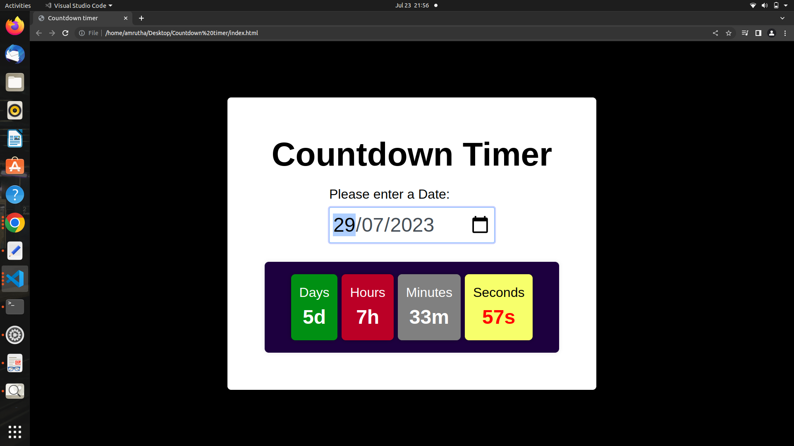

# Countdown-timer-Vue
<h1>Countdown Timer
</h1>

This is a countdown timer created using Vue JS

<ul>Here is a list of features availed:
  <li> -Component rendering: 2 parent components and 3 child components</li>
  <li> - Watchers to trigger the event handling </li>
  <li> - Mixins to make repetitive use of the APIs mentioned</li>
</ul>

You can make use of them by regular cloning

<em>Happy coding!</em>

Here is a sample preview

Preview</img>
